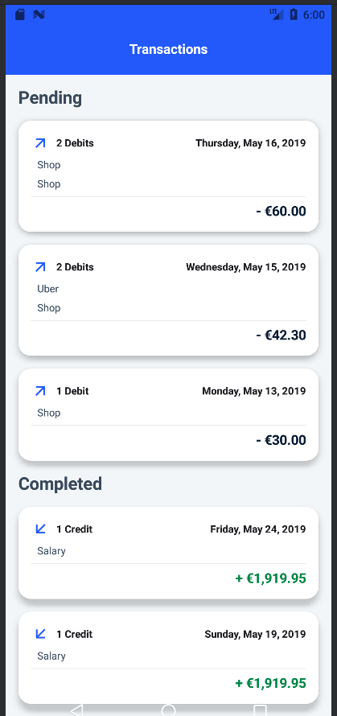
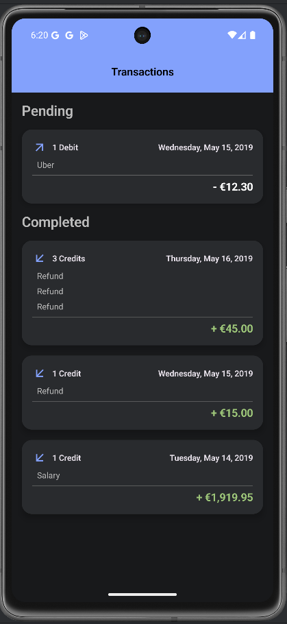
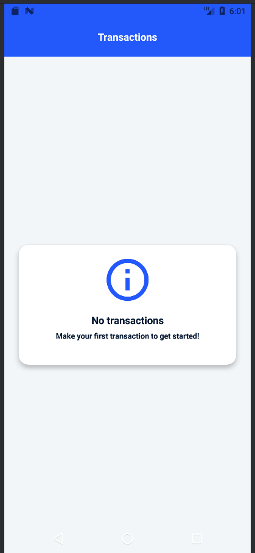

# 💰 Transactions App

A simple Android application designed to display financial transactions, categorized into Pending and Completed states. This project demonstrates modern Android development practices, including a clean UI, **robust state handling**, and **multi-theme support**.

---

## 🖼️ App Showcase

### **Key Application States and Theme**
The app handles various UI states (Loaded, Empty, Error) and supports both light and dark themes.

| Transaction List (Light Mode) | Transaction List (Dark Mode) | Empty State |
| :---: | :---: | :---: |
|  |  |  | 

 

### **App Demonstration**
You can view short videos demonstrating the app's functionality and cross-SDK behavior below.

  <strong>Max SDK Version</strong>
  <video src="https://github.com/user-attachments/assets/a5b93776-0e70-4701-9b30-eac5adb5f01c" width="350" controls title="Max SDK Version"></video>
   
  <strong>Min SDK Version</strong>
  <video src="https://github.com/user-attachments/assets/fe4ef289-9507-4fb8-a989-fdfa2e70a9de" width="350" controls title="Min SDK Version"></video>

---

## 🛠️ Project Structure and Technology Stack

### **Architecture**
The project is structured following the **MVVM (Model-View-ViewModel)** architectural pattern. This separation of concerns ensures the code is **testable**, **scalable**, and **maintainable**.

### **Data Handling (Simulated API)**
Instead of external network calls, transaction data is sourced from a **simulated API (`TransactionsApiImpl`)**. This class is designed to demonstrate realistic data fetching scenarios, including:
* **Simulated network latency** (`delay`).
* **Different transaction payloads** (empty, pending, completed, mixed).
* **Simulated network error** (`IOException` failure).

### **Key Technologies Used**
* **Language:** Kotlin
* **Architecture:** MVVM
* **UI Toolkit:** **Jetpack Compose** (For declarative and modern UI development, including dark mode handling).
* **Dependency Injection:** **Hilt** (For simplified dependency management and scope control).
* **Asynchronous Operations:** **Coroutines / Kotlin Flow** (For concurrent, non-blocking data fetching and UI state updates).
* **Serialization:** Kotlinx Serialization (Implicitly used for parsing the simulated JSON data).

---

## ✨ Features

* **Multi-Theme Support:** Seamlessly supports **Light and Dark Mode**.
* Displays transactions in **Pending** and **Completed** sections.
* Clearly handles and displays different UI states (**Loaded, Empty, Error**).
* Demonstrates compatibility across different Android SDK versions.
* Uses a simple, modern design for excellent readability.
